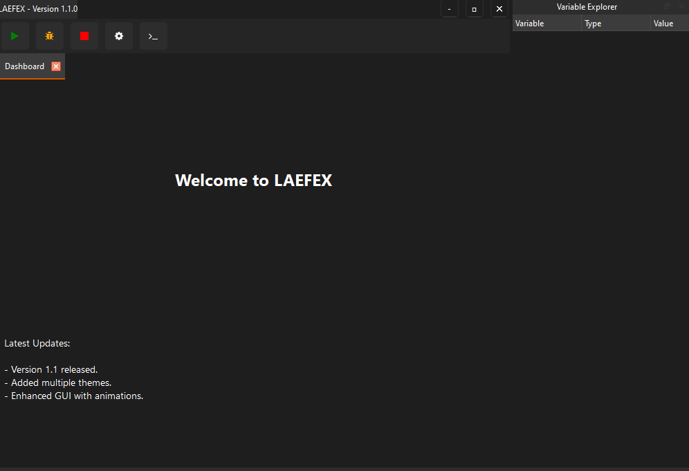

# LAEFEX - Lightweight Advanced Executable Framework for EXecution

**Version 1.1.0**

[](https://pypi.org/project/PyQt6/)
[](https://www.python.org/downloads/)
[](./LICENSE)

LAEFEX is a powerful and user-friendly Python code editor and executor built with PyQt6. It offers a rich set of features to enhance your coding experience, including syntax highlighting, code folding, autocompletion, error underlining, code snippets, and an integrated mini-map for quick navigation. **EARLY BETA. PURELY FOR DESIGNS RIGHT NOW.**



---

## Table of Contents

- [Features](#features)
- [Installation](#installation)
- [Getting Started](#getting-started)
- [Directory Structure](#directory-structure)
- [Usage](#usage)
  - [Code Editing](#code-editing)
  - [Running Code](#running-code)
  - [Debugging](#debugging)
  - [Terminal Output](#terminal-output)
  - [Settings](#settings)
- [Screenshots](#screenshots)
- [Contributing](#contributing)
- [License](#license)
- [Acknowledgments](#acknowledgments)
- [Contact](#contact)

---

## Features

- **Syntax Highlighting**: Enhanced highlighting for Python code, including keywords, strings, comments, and functions.
- **Code Folding**: Collapse and expand code blocks like functions, classes, and loops for better code organization.
- **Autocompletion**: Intelligent suggestions for keywords, variables, and functions as you type.
- **Error Underlining (Linting)**: Real-time detection and underlining of syntax errors.
- **Code Snippets**: Quickly insert commonly used code structures through the context menu.
- **Mini-map**: A scaled-down preview of your code for quick navigation.
- **Bracket Matching**: Highlights matching brackets to help you keep track of your code structure.
- **Find and Replace**: Easily search and replace text within your code.
- **Integrated Terminal**: View the output of your code execution within the application.
- **Customizable Themes**: Choose from available themes or customize your own for the editor.
- **Customizable Fonts**: Adjust the font type and size to your preference.
- **Multi-Tab Interface**: Work on multiple files simultaneously with tabbed editing.

---

## Installation

### Prerequisites

- **Python 3.7 or higher**
- **PyQt6**: Python bindings for the Qt application framework.
- **qtawesome**: Icon library for PyQt.

### Steps

1. **Clone the Repository**

   ```bash
   git clone https://github.com/laef1/LAEFEX.git
   cd LAEFEX
